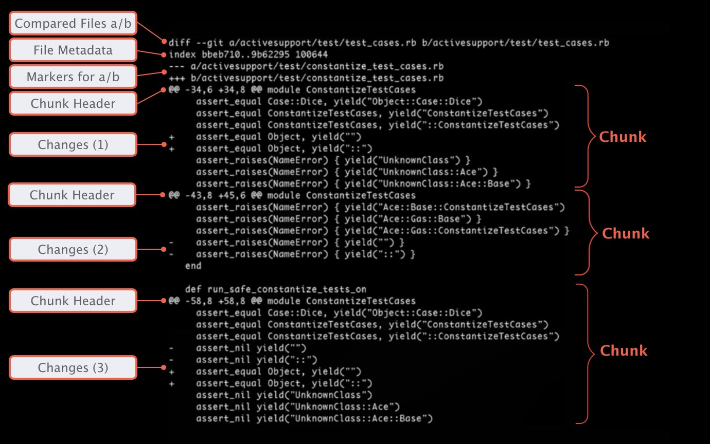

# 设计文档

记录使用到的库，算法。方便沟通协作，后续维护。

## 总体思路

使用 Git 或 Mercurial 这类源代码管理工具时，可以通过运行 `git diff` 或者  `hg diff` 获取本次提交涉及的改动。

通过获取本次提交的改动，然后提取 diff 的信息，用于得到本次提交会涉及到哪些文件，文件改动的行数。

## diff 格式

- [阮一峰：读懂 diff](http://www.ruanyifeng.com/blog/2012/08/how_to_read_diff.html)

## 获取本次提交的 diff

### Mercurial

### Git

## 从 diff 中提取相关信息

### Python 源代码文件

### 文件改动的行数

## 在 Python 中运行 pylint

## 输出改动部分的检查结果

## 测试

记录单元测试的思路。